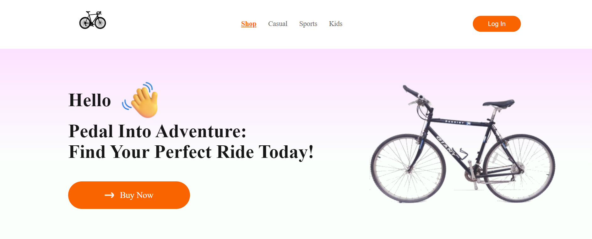
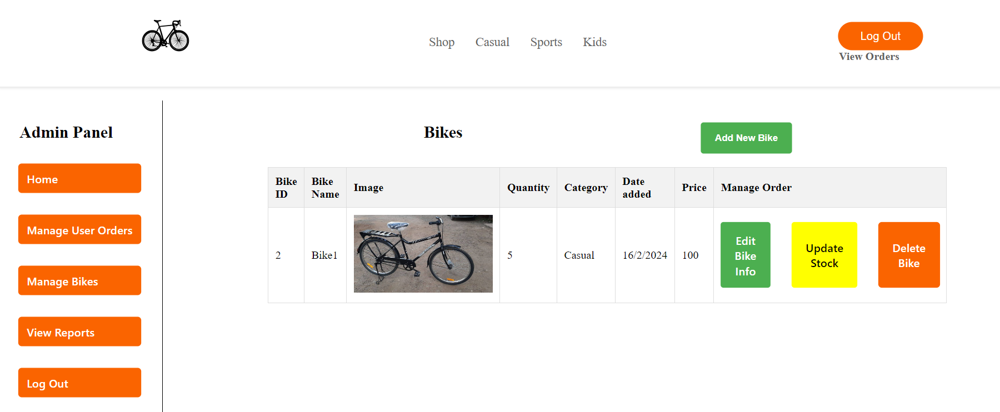
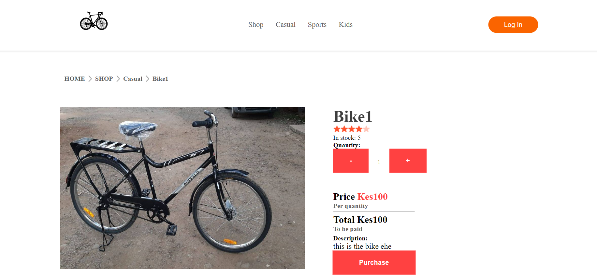

## Bicycle- Ecommerce

## About This Project

- Bicycle-Ecommerce is a **bicycle** e-**commerce** **website** designed to provide users with a platform for **browsing** and **purchasing** bicycles **online**. Whether you're a cycling enthusiast or simply looking for a convenient way to shop for bicycles, this website offers a seamless shopping experience.

### Key Features

- **Browse and Purchase**: Users can easily browse through a wide range of bicycles available on the platform and make purchases with just a few clicks.
- **Product Details**: Detailed product descriptions, including specifications, features, and images, are provided to help users make informed purchasing decisions.
- **User Authentication**: Secure user authentication ensures that only authorized users can access certain features, such as placing orders and managing their accounts.
- **Responsive Design**: The website is designed to be responsive, ensuring a seamless user experience across various devices, including desktops, tablets, and smartphones.
- **Order Management**: Users can view their order history, track the status of their orders, and manage their shopping carts conveniently.
- **Search Functionality**: A search feature allows users to quickly find specific bicycles or product categories based on their preferences.
- **Customer Support**: Dedicated customer support services are available to assist users with any inquiries, issues, or feedback they may have.

### Technologies Used

- **Frontend**: The frontend of the website is built using modern web technologies such as **HTML**, **CSS**, **JavaScript**, and a frontend library **React.js** for dynamic user interfaces.
- **Backend**: The backend server is developed using a server-side programming language like Node.js, Python, or PHP. It interacts with the database, processes user requests, and serves dynamic content to the frontend.
- **Database**: A relational database management system **MySQL** used to store product information, **user data**, **product details** and **order details**.
- **Authentication**: User authentication and authorization are implemented using authentication middleware or services like JSON Web Tokens (JWT) or OAuth for secure access to user-specific features.
- **Web Hosting** (Not Hosted Yet ⚠️): The website is hosted on a cloud platform such as Amazon Web Services (AWS), Google Cloud Platform (GCP), or Microsoft Azure for scalability, reliability, and performance.

### Future Enhancements

- **Payment Integration**: Integration with mobile payment gateways like M-Pesa, PesaPal, or other **Mobile-banking platforms** to facilitate secure online transactions.
- **Social Media Integration**: Integration with social media platforms to enable **social sharing**, **user engagement**, and **marketing opportunities.**
- **Personalized Recommendations**: Implementing **machine learning algorithms** to provide personalized product recommendations based on user preferences and browsing history.
- **Localization**: Adding support for multiple languages and currencies to cater to a global audience and improve accessibility.
- **Performance Optimization**: Optimizing website performance by implementing techniques such as, **caching** to reduce load times and **enhance user experience**.

### Usage

1. Git clone the whole repo
2. Install [node](https://nodejs.org/en/download/current)
3. cd into the `backend` and `frontend` directories
4. For backend install [xampp](https://www.apachefriends.org/download.html) and import the `e-cycle_db.sql` schema file into the database.
5. Run `npm install` in both directories
6. Run `npm start or npm run dev` in both directories
7. Open browser navigate to the link `https://localhost:5173`

### Demo

#### Homepage

#### Admin Bike Page

#### Product Page

